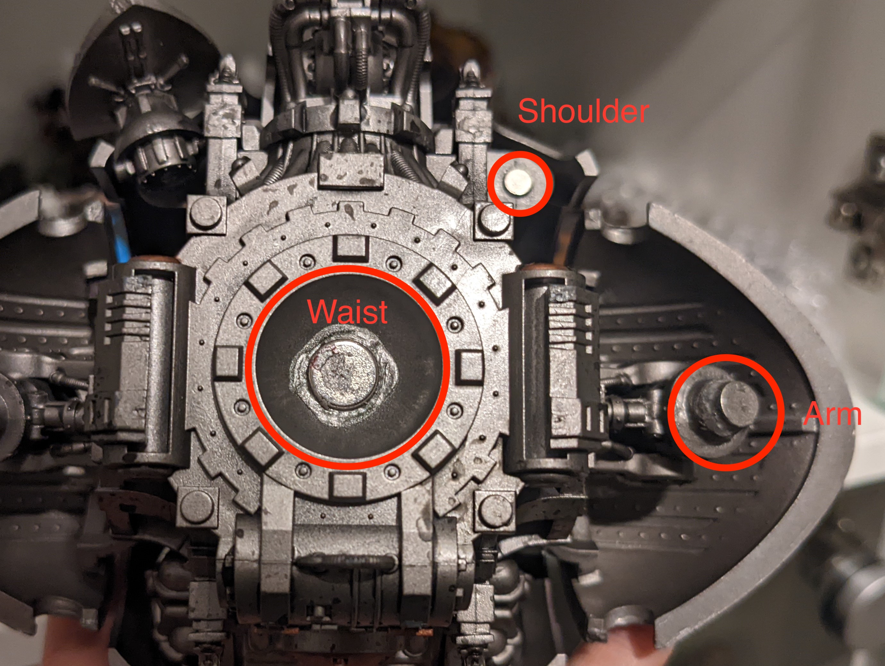

# How to magnetize your imperial knight
**Filthy chaos knights players keep out**

These instructions describe the steps to add magnets to the standard Canis Rex imperial knight kit to allow for use of 
all weapon options. They can easily be adapted for other knight types, e.g. Castellan.

The overall process ideally needs to be done in two sittings - some parts need to dry overnight before moving onto the next step. 

## Your shopping list
| Item          | Count |
|---------------|-------|
| Clippers      | 1     |
| Green Stuff   | Some! |
| Superglue     | 1     |
| 8x2mm magnets | 2     |
| 6x1mm magnets | 12    |
| 3x1mm magnets | 4     |
| Sharpie       | 1     |

The magnet sizes are somewhat flexible - the 8x2mm and the 3x1mm could be easily substituted for another similar size.  
The 6mm ones need to be that diameter to fit inside the arm joints.

## General tips for working with magnets and Green Stuff

### Never glue it on the wrong way round again
Use your Sharpie to mark one side of your magnet before gluing to avoid any accidents.

I generally try to mark the side which I will be gluing down, for consistency. The easiest way to do this when gluing a 
number of magnets the same way is to stick the stack of magnets to the thing they will connecting to. 

E.g. if you have a magnet already attached to the shoulder of your knight and want to add magnets to the gun options, 
stick the stack of magnets to the shoulder. Then you can mark the magnet facing away from the shoulder, and this will be 
the side to glue down on the gun. 

### Green Stuff magic
For a couple of parts on the knight, we use Green Stuff to attack magnets and need to carefully line up with the 
opposite magnet, e.g. the waist joint. This can turn into a sticky mess, because it requires you to align the two before 
the epoxy cures.

Conveniently, the solution to the problem comes free with the Green Stuff! The soft plastic wrapper that it is rolled up 
in is designed not to stick to the Green Stuff, and this holds true even once it is mixed. 

When joining up two sides of a part that uses Green Stuff, you can add a layer of this plastic in between, let it dry 
with the magnets touching so you know they are definitely lined up correctly, and then it will pull apart perfectly once 
it is dry. 

### But it still sticks to me! Help!
Just use water. Have a little pot of water handy and make sure your fingers stay slightly wet while handling the Green 
Stuff. 

## Assembling your knight with magnets: Day 1

### Assembly before we get to the magnets
Start by completely assembling the legs of your knight. The only part to be magnetized here is the waist, so follow the 
instructions as normal.

Next, begin assembling the torso, but do not glue on any of:
- Arms (leave these completely for now)
- Top carapace
- Shoulder weapon (i.e. small meltagun or stubber)

When you get to the instructions for the shoulder weapon, instead just glue on the C-shaped bracket piece without adding 
a gun. This will create a flat surface that we can stick a magnet to. 

It is good to move on to the top carapace weapon magnet immediately, so that the top carapace can be glued on before the 
plastic glue fully dries. This avoids any issues with it not sitting on correctly because the walls are out of line. 

You should now have legs and a torso with a bottom, 2 side panels, front and back panels, exhausts, but no roof, plus the tilting 
shield and empty shoulder weapon bracket. You are now ready to start magnetising. 

### Top carapace magnet

Cut out and prep the top carapace piece (the giant rounded roof part) and find the small round hole in the middle where 
the carapace weapons attach, e.g. the rocket pod. We are going to add a magnet that these weapons will stick to.

Use a 6x2mm magnet here (although similar sizes would work fine)

Glue the magnet to the inside of the carapace, so that it will not be visible from the outside. Direction does not 
matter at this stage - we will glue the carapace weapons to match. 

### Continue assembly
Now glue on the top carapace! Take your time to make sure it fits well. 

Also assemble your icarus autocannon (top) and your heavy stubber, meltagun and little laser doodad (shoulder). 

James will hopefully have provided you with two of the little hanging bracket for the shoulder weapons - for the 
leftover gun we will attach the magnet directly to the back of the gun. I recommend the little laser for this, because 
it has a nice long body. 

### Shoulder magnet
Use a 3x1mm magnet

Glue this to bottom of the empty shoulder weapon bracket. Direction does not matter - we will make the guns match.

We will let this dry while we do the top weapons. 

### Top weapons
I'm assuming your knight has the option of two different rocket pods and the icarus autocannon. Unfortunately, the 
two rocket pods share a lot of parts, so this is the one weapon option I can't tell you a good way to magnetise. 
Personally, I just bought another one off ebay so I could have both options. 

**Rocket pod**:
Use 2/3 6x1mm magnets. Start by sticking them on top of the carapace to the magnet you have glued inside. You can mark 
the top of the stack as the side that will be facing away from the knight.

Take the piece which is the bottom of the rocket pod. We will set the magnet inside before we assemble. Glue the magnet 
inside, on top of the part which would join to the hole in the carapace. 

If you have marked the top of your magnet, this will be facing upwards inside of the rocket pod. 

Once the glue is dry, test the fit. You may need to trim a small amount off the bottom of the little peg as there will 
be a magnet blocking the hole it is supposed to go into. 

You can now assemble the rest of the pod according to the instructions - if you only have one, make sure you pick your 
favourite!

**Icarus autocannon**:
The magnet will sit on the bottom of this gun. First, we need to trim off the peg and raised rim around it to make a 
flat surface on the bottom of the gun. Clippers should be sufficient. Make sure the resulting surface is as flat as 
possible so that the magnet will have a good surface to stick to. 

Now superglue the magnet to it. If you have marked the top of your magnet stack, the marked side will be the side glued 
to the gun. 

### Shoulder weapons
The magnet on the shoulder bracket should now be dry. Stick your remaining stack of 3x1mm magnets to it - they should 
be below the bracket. Mark the side that is facing towards the floor. 

Take your 3 shoulder weapon options. 2 of these will have the little pivoting dangly bracket attached and one will not. 

**Dangly brackets**:
Clip off the top part of the bracket where the narrow part is that should slot into the shoulder. Again, clean this up 
to make a flat surface on the remaining stem. 

Now glue your magnet to that stem - the marked side will be glued down. 

**No bracket**:
Even simpler! Just find a good flat part on the rear of the gun, and attach your magnet. Marked side is glued down. This 
actually looks great on the finished product because it doesn't droop! 

### The waist
Start by creating a flat surface on top of the leg joint. This is a dome-shaped piece with a small peg on top. Cut off 
the peg with your clippers, and then use your clippers to flatten it a little. Don't worry if the flat area is smaller 
than your magnet - we will use Green Stuff to fix all problems. 

The legs will also need to be able to stand and support the torso - ideally glued to the base.

The moment we have all been waiting for - we get to break out the Green Stuff. Knead up a £1 sized piece ready to use. 

Also prep yourself your little piece of plastic wrapper - about 1" should be enough. 

Take 2 8mm magnets, and mark these so you know which side is which. 

Glue one magnet to the surface you made on the legs. Now go have a cup of tea while it dries a little. 

Take about half of your Green Stuff. We will mould the Green Stuff around the magnet to create a little 
magnet nipple like in the image. I like to make a tiny sausage shape and wrap it around the base, then use my fingers to 
smooth it down.  Avoid too much Green Stuff sitting on top of the magnet. Don't worry if it doesn't look beautiful - it 
won't be visible when the top is attached. 

*Image to be added once I get up the loft and can photograph the legs!*

Now we set the other magnet into the rounded hole in the bottom of the torso, as in the image. Take care that the magnet 
is the correct way up. 

This time we just use Green Stuff. Put your blob of Green Stuff in first, then gently press the magnet into it. Take 
care not to push too much of it into the hole. Don't worry too much about aligning it - we will fix that next.

Now take your piece of soft plastic, and cover the leg magnet with it. Then, using that to separate the two pieces of 
Green Stuff, pop the torso on top. Take care as you do this so that the magnets stay roughly in place. 

You should now be able to gently reposition the joint. It's important to make sure it is sitting level. The Green Stuff 
is still soft, so you can move it around to get a good finish. 

Now we need to let it dry - to avoid any problems with gravity messing up our handiwork, use some random objects to prop 
the torso in place where you want it. 

### Great job!
Now go get some beauty sleep. You'll need it for all the society parties you'll be invited to as a swanky imperial noble.

## Magnets: how do they work pt 2
Coming soon - how to to arms and guns

### Finally, glue on any decorative parts you may have missed off
Obvious candidates are the little rails on the top, the mechanicus cogs, etc. 